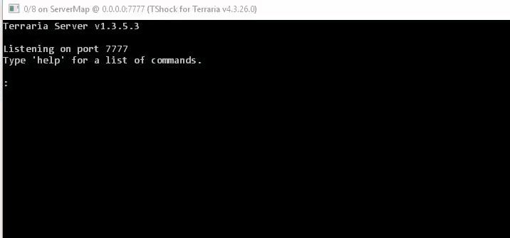

# LuaPlugin


## About
This plugin allows you to use Lua for writing and executing scripts for your TShock server.
You can also run scripts from console or chat for debug purposes.
Lua is a very fast, powerful and flexible scripting language. It is one of the fastest
scripting languages in the world! Although lua can be multi-threaded this plugin provides single-threaded lua only.

## Installing
This plugin is for TShock version 4.3.26 and uses Newtonsoft.Json version 10.
To install the plugin you need to do this:
* Install [Visual C++ Redistributable 2015 (x86)](https://www.microsoft.com/en-us/download/details.aspx?id=48145).
* Add lua54.dll, KeraLua.dll, NLua.dll, MyLua.dll from acrhive to server root path (near TerrariaServer.exe).
* Add ServerPlugins/LuaPlugin.dll from archive to ServerPlugins directory.
* Highly recommended to add LuaScripts folder from archive to server root path (at least at first).

Then run the server and it will create iron_python_config.json, where you probably want to write something like this:
```json
{
	"command_specifier": "\\",
	"control_permission": "lua.control",
	"execute_permission": "lua.execute",
	"default_environment": "main",
	"untrusted_environment": "untrusted",
		"environments": {
		"main": {
			"directories": [
				"C:\\Path\\To\\Scripts\\Folder",
				"C:\\Yet\\Another\\Path"
			]
		}
	},
	"use_traceback": false
}
```

## Usage
Now you can place .lua files in folders specified in config and server will execute them.
You can also use lua in console:
```
;import("System")
;Console.WriteLine("ok")
```
The ";" symbol is defined in config as "command_specifier" and it determines that you are typing lua script.
You can use it even from in-game chat with the same syntax if you have execute permission (see config).
Read about NLua integration to .NET [here](https://github.com/NLua/NLua#building).
This repository already contains a [folder](https://github.com/ASgoPew/LuaPlugin/tree/master/LuaScripts) with some basic scripts.
It is strongly recommended to add folder with these scripts to config at first. All examples below imply that.

## Basic events
Plugin will run a lua function "OnInit" on plugin initialization (and on "/lua reset" command) if such exists and
"OnClose" on plugin dipose (and on "/lua reset" command as well).
When you try to execute command from console/chat it will first try to execute it through "execute" (see [init](Scripts/11_init.lua)) function if such exists.
Otherwise it will run it directly.

## lua command
Plugin adds /lua command. You can use /lua reset to reset lua environment. Environment reset means that all
variables will be removed and all specified in config scripts would be reexecuted.

## Scripts folder
Currently existing scripts allow you to do this:
* Function "puts" that prints all the output to the player who executed the command (in chat) or in console if this is console.
* Lua will have a variable "me" of last (or current) player who executed (or executes) the script or the TSPlayer.Server if this is console.
* Use a shortcut for print function: ";;1+3" (is the same as ";puts(1+3)") will print "4" in console/chat.
* Use a shortcut for print object properties function: ";=me" will print all the fields, properties and methods of TSPlayer class.
* A few helper functions like "delay", ...

## Dependencies
This plugin uses [NLua](https://github.com/NLua/NLua)